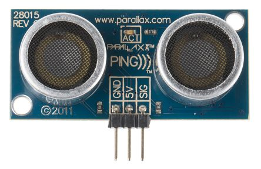

* Parallax
	* Source - John Hemann
		* The company that made our device is called Parallax. Their founder was Chip Gracey and he made the company in 1987. They make a wide variety of hardware like microcontrollers, robots, sensors, and boards. They also make a ton of devices that are aimed at teaching people about the basics of programming with devices like the Ping. Because of their goal to educate people, they also have programs to teach people from elementary school to college.

* Ping Ultrasonic Distance Sensor
	* Basic Features - Michael Salas and Garrett Dipalma
		* Ping
			* Provides precise distance measurements within a 3 cm to 3 m range
			* Ultrasonic measurements work in any lighting condition, making this a good choice for object detectors which work in a variety of enviornments.
			* The pulse in/pulse out communication requires just one I/O pin
			* The indicator LED shows measurement in progress
			* 3-pin header makes it easy to connect to a development board, directly or with an extension cable.

		* The Uno board has seven general pins and six special function pins. It also uses the ATmega328p AVR (8-bit) microcontroller, it weighs 28 grams. it has a flash memory storage of 32 kB and does 20 MIPS (20 Million Instructions per second).
	:1. LED: There is one LED on the board. It is one when it has a HIGH value and off when it has a LOW value.
	:2. VIN (Input Voltage): The input voltage to the Arduino board when it's using an external power source.
	:3. 5V: This pin outputs a regulated 5V from the regulator on the board. The board can be supplied with power either from the DC power jack (7 - 12V), the USB connector (5V), or the VIN pin of the board (7-12V).
	:4. 3V3: A 3.3 volt supply generated by the on-board regulator.
	:5. GND: Ground pin.
	:6 IOREF: This pin on the Arduino Uno R3 board provides the voltage reference with which the microcontroller operates
	:7. Reset: a resettable polyfuse that protects your computer's USB ports from shorts and overcurrent when more than  500 mA is applied to the USB port
	
	* Special pins
	:1. Serial: Pins 0 (RX) and 1 (TX). Used to receive (RX) and transmit (TX) TTL serial data.
	:2. External Interupts: Pins 2 and 3. These pins can be configured to trigger an interrupt on a low value, a rising or falling edge, or a change in value
	:3. PWM (Pulse Width Modulation): Pins 3, 5, 6, 9, 10, and 11. Provide 8-bit PWM output with analog functions.
	:4. SPI (Serial Peripheral Interface): Pins 10 (SS), 11 (MOSI), 12 (MISO), 13 (SCK). These pins support SPI communication using the SPI library.
	:5. TWI (Two Wire Interface): A4 or SDA pin and A5 or SCL pin. Support TWI communication. 
	:6. AREF (Analog REFerence): References voltage with analog inputs.
	
	
* Controlling the device
	* We used pin 7 which is on PORTD on the Arduino board. This is the only pin required because it swaps between input and output.
* Device demonstration
        * The device will send out a pulse. It the pulse doesn't return before the timer expires then the object is to far away. The device is calibrated to detect when something is 10cm away and flip an led on indicating to the user that they are within 10cm of an object.

* Project Code
	
:: code-block::
; Ping for AVR
; Author: Group jhjcms

#include "config.h"

	.section .data
dummy: 	.byte 0		; dummy global variable

        .section .text
        .global     main
;        .extern     delay          
        .org        0x0000

main:
	; clear the SREG register
        eor     r1, r1                  ; cheap zero
        out     _(SREG), r1                ; clear flag register

        ; set up the stack
        ldi         r28, (RAMEND & 0x00ff)
        ldi         r29, (RAMEND >> 8)
        out         _(SPH), r29
        out         _(SPL), r28

	; initialize the CPU clock to run at full speed
	ldi         r24, 0x80
        sts         CLKPR, r24              ; allow access to clock setup
        sts         CLKPR, r1               ; run at full speed
        
	; set up the LED port
	sbi         LED_DIR, LED_PIN        ; set LED pin to output
        cbi         LED_PORT, LED_PIN       ; start with the LED off

        ; set up the PING port
        sbi         PING_DIR, PING_PIN        ; set PING pin to output
        cbi         PING_PORT, PING_PIN       ; start with the PING off

        ; enter the ping loop
1:    	; call       toggle
	rcall       delTwoMs
	rcall       togglePing
	rcall	    delayFiveMs
	rcall	    togglePing
	sbi         PING_READ, PING_PIN
	
	ldi	    r19, 50
;	ldi         r20, 93
	rcall	    2f

	; checks if pulse got back before timer expired, if expired skip 
	; turning on led
	cpse        r19, 0
	rcall       toggleLed	

	; make code to calc distance
;	call 	    print ; will be c++ function
	; 

	rcall	    togglePing
	rcall       toggleLed
        rjmp        1b

	; checking for sound to come back
2:      ; decrements first reg, gets PING_PORT and returns if gets pulse
	; back or timer reaches 0
	dec	    r19
	ldi         r20, 93
	in          r24, PING_PORT
	cpse	    r24, 0 ; checks if r24 has ping toggle, if not it skips ret
	ret
	cp          r19, 1
	brsh        3f
	ret

3:
	dec         r20
	cp          r20, 0
	breq        2b
	jmp         3b
	

togglePing:
        in          r24, PING_PORT           ; get current bits
        ldi         r25, (1 << PING_PIN)     ; PING is pin 7
        eor         r24, r25                 ; flip the bit
        out         PING_PORT, r24           ; write the bits back
        ret

toggleLed:
        in          r26, LED_PORT           ; get current bits
        ldi         r27, (1 << LED_PIN)     ; LED is pin 5
        eor         r26, r27                ; flip the bit
        out         LED_PORT, r26           ; write the bits back
        ret

; delays machine for 5 microseconds
delayFiveMs:
	ldi         r18, 80
  	ldi	    r17, 0

loopForFiveOne:	
	dec         r16
	cp          r16, r17
	brne        1b
        ret

; delays machine for 2 microseconds
delTwoMs:
	ldi         r16, 32
 	ldi         r17, 0

loopForTwoOne:	
	dec         r16
	cp          r16, r17
	brne        1b
	ret
